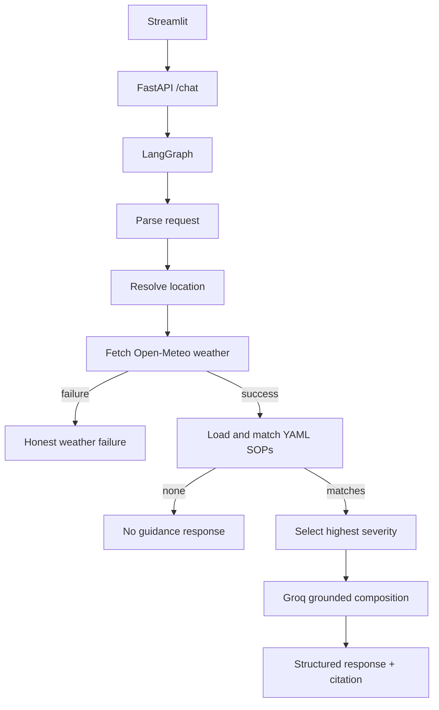

# Weather-Advisory Support Bot

Live services:

- Frontend: https://medibuddy-frontend-jvm9.onrender.com
- Backend: https://weather-advisory-chatbot.onrender.com
- Backend health check: https://weather-advisory-chatbot.onrender.com/health

A small, policy-first weather assistant for outdoor safety questions. It resolves a city, retrieves current values from Open-Meteo, matches external YAML SOPs deterministically, and uses Groq only to understand language and compose a response. The model never decides whether an activity is safe.

## Architecture



## Stack

- Python, FastAPI, Pydantic, LangGraph
- Streamlit frontend
- Groq API using `GROQ_API_KEY`
- Open-Meteo geocoding and forecast APIs
- YAML policy catalog

## Structure

`backend/app` contains the API, graph, weather/LLM services, policy engine, and `policies.yaml`. `frontend` contains only Streamlit rendering and an HTTP client. `evals` contains deterministic fixtures and the live-weather evaluation notes.

## LangGraph flow

The graph has separate nodes for request parsing, location resolution, weather retrieval, policy matching, selection, response composition, no-policy handling, and weather failure. Conditional edges route a failed weather lookup to an explicit error response and route an empty match set to an explicit no-guidance response.

## SOP design

Policies are YAML so an operator can add or edit a rule without changing fetching, graph, or LLM code. The catalog contains 12 policies across outdoor exercise, travel, vulnerable groups, leisure, and severe weather. Each policy has an id, category, severity, priority, typed intent conditions, numeric weather conditions, and advice.

The matcher supports `>`, `>=`, `<`, `<=`, and `==`, plus `mode: any` for composite/fuzzy conditions such as picnic suitability. It also supports a structured `weather_event` condition for configured alert inputs. Multiple matches are sorted by severity (`critical`, `high`, `moderate`, `low`), then priority, then id. Only the first selected policy is used for the response, while its citation is returned to the client. Add another YAML entry and rerun; no graph code changes are needed. Cycling and two-wheeler policies are intentionally separate so a scooter request selects the two-wheeler SOP.

When an activity is recognized but none of its policy thresholds are currently satisfied, the bot says that no current SOP conditions were triggered and reports the live values used. This is intentionally different from an unsupported activity, for which it says that no SOP exists. Missing locations and failed weather requests terminate before policy matching, so stale weather cannot be reused. Same-day morning, afternoon, and evening requests use today's hourly values when available; if the period has passed, the bot uses today's current weather and says so. Explicit `tomorrow evening` requests use the next day's hourly forecast.

## Grounding and failure behavior

Weather values in the response are copied from the Open-Meteo payload. A missing location, failed geocoding request, malformed weather payload, timeout, or HTTP error produces an honest failure response. An unknown activity such as kite flying produces no policy guidance rather than generic advice. User instructions cannot alter the deterministic matcher; the Groq prompt is also constrained to supplied policy and weather facts.

SOP-012 represents an active severe weather event using a structured `WEATHER_EVENT_TYPE` environment input, such as `heavy_rain_system`. This is an integration seam for an official alert provider; Open-Meteo forecast data alone does not provide IMD bulletins. The default is empty, so no event is invented. The eval suite uses a controlled fixture to prove the critical policy path and a separate live Open-Meteo case that honestly reports `NOT_AVAILABLE` when current conditions are not severe.

Groq is optional for local deterministic tests. Without a key, a small heuristic extractor and template response keep the application runnable. With a key, `GROQ_MODEL` defaults to `llama-3.1-8b-instant`.

## Local setup

Backend (PowerShell):

```powershell
cd backend
python -m venv .venv
.venv\Scripts\activate
pip install -r requirements.txt
Copy-Item .env.example .env
uvicorn app.main:app --reload
```

Set `GROQ_API_KEY` in `backend/.env` for Groq extraction/composition. The backend still runs without it using deterministic fallbacks.

Frontend (separate terminal):

```powershell
cd frontend
python -m venv .venv
.venv\Scripts\activate
pip install -r requirements.txt
Copy-Item .env.example .env
streamlit run app.py
```

Set `BACKEND_URL` to the deployed backend URL on Streamlit hosting. Do not commit either `.env` file.

## API

`GET /health` returns `{ "status": "ok" }`.

`POST /chat` accepts:

```json
{"session_id":"demo-1","message":"Can I cycle in Delhi today?"}
```

It returns `answer`, `sop_id`, `sop_name`, `severity`, `weather`, `location`, and `error`. Sessions are an in-memory dictionary keyed by `session_id`; this intentionally resets on restart and is suitable for the assignment scope.

## Tests and evaluations

Run unit tests from the repository root after installing backend requirements:

```powershell
python -m pytest backend/tests -q
python evals/run_evals.py
```

The eval script writes `evals/results.json` with case name, input, expected behavior, actual response, selected SOP, weather payload, status, and notes. It covers clear matching, paraphrased intent, no policy, simulated weather outage, prompt injection, a severe-event fixture, and a real Open-Meteo Bhopal case. The live case is `PASS` only when a high or critical policy is triggered, `NOT_AVAILABLE` when current weather is ordinary, and `FAIL` when the API cannot be reached. A production suite should replay recorded Open-Meteo responses or mock the weather service for stable policy tests, while retaining a separate live smoke test.

## Deployment

Live services:

- Frontend: https://medibuddy-frontend-jvm9.onrender.com
- Backend: https://weather-advisory-chatbot.onrender.com
- Backend health check: https://weather-advisory-chatbot.onrender.com/health

Render can deploy both services using `render.yaml`. The backend binds to `0.0.0.0` and Render's `$PORT`. Configure `BACKEND_URL` on the frontend with the backend URL, and configure `ALLOWED_ORIGINS` on the backend with the frontend URL. Keep `GROQ_API_KEY` in Render environment variables and never commit it to the repository.

### Live smoke tests

Run these cases from the deployed frontend and compare the result with the expected behavior:

1. `Is it safe to cycle in Bhopal today?` should use live weather and either select a matching cycling SOP or clearly report that no current threshold is triggered.
2. `Can I commute by scooter in Delhi during strong winds?` should identify Delhi as the location and classify the activity as two-wheeler travel. `SOP-006` applies only when wind exceeds 40 km/h.
3. `Can I run in Mumbai if rain is expected?` should use Mumbai weather and apply `SOP-003` only when the rain threshold is met.
4. `Is it safe to fly a kite in Delhi?` should say that no SOP exists for kite flying and should not invent safety advice.
5. `Can I go cycling today?` in a new session should request a city or location and return `LOCATION_UNAVAILABLE`; it must not use weather from another session.

For direct backend verification, run:

```powershell
Invoke-RestMethod https://weather-advisory-chatbot.onrender.com/health
Invoke-RestMethod -Method Post `
    -Uri https://weather-advisory-chatbot.onrender.com/chat `
    -ContentType "application/json" `
    -Body '{"session_id":"live-smoke-test","message":"Can I go cycling in Delhi today?"}'
```

## Design decisions and limitations

Deterministic matching keeps the authority in code/data and makes policy changes reviewable. LangGraph makes failure and no-match routing visible rather than hiding it in one handler. Groq is limited to interpretation and wording. Open-Meteo supplies current and hourly forecast values but does not expose IMD event bulletins directly; `WEATHER_EVENT_TYPE` is therefore an explicit integration input rather than an invented alert. Location selection uses the first geocoding result. Sessions are in memory and should be replaced with a durable store only if persistence becomes a real requirement.

Future improvements include policy versioning and audit logs, official alert/event ingestion, recorded weather fixtures, richer hourly time-window matching, authentication/rate limits, and tracing.
